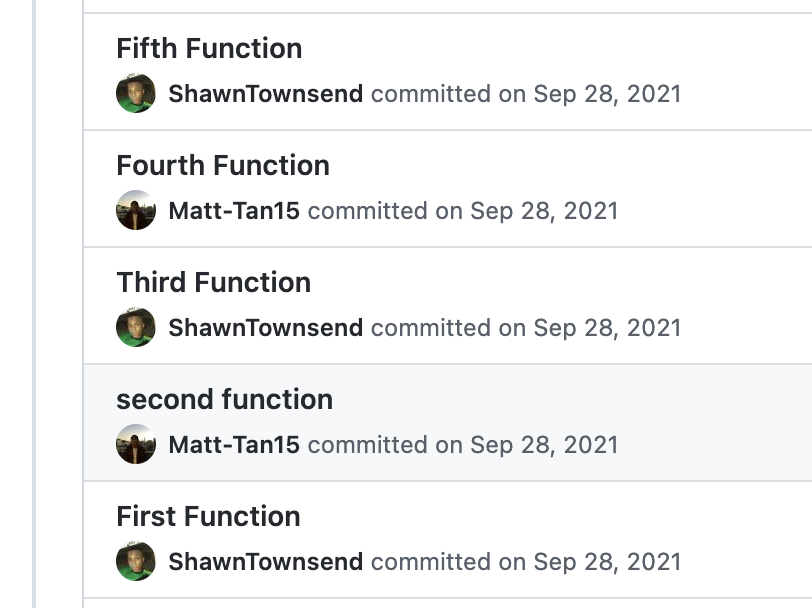

# Intro to Git and JavaScript Pairing Lab

The purpose of this lab is to get you and your partner familiar with `git`, specifically, how to:
* Fork a repository
* `git clone` down a remote repository
* `git add` to stage and `git commit` to commit changes
* `git push` to push up commited changes from a local repo to a remote repo
* `git pull` to pull down changes from a remote repo to a local repo
* Use git to work collaboratively on a shared code base!

## Instructions

> Remember, [paired programming](https://en.wikipedia.org/wiki/Pair_programming#:~:text=Pair%20programming%20is%20an%20agile,two%20programmers%20switch%20roles%20frequently.) means both partner are always looking at, and working off of the same screen! When you are the driver, you group should be working off your computer. And when you switch, you should be working off your partner's computer. By doing so, you will get practice with push and pull using git!

Read these instructions in their entirety before beginning:

0. You will work in groups to implement various JavaScript functions.  
1. One group member, Partner A, will [fork](https://guides.github.com/activities/forking/) this repository. Only one group member should fork the repo. Partner B does not need to fork anything.
2. In the **forked repository**, Partner A needs to add Partner B as a [collaborator](https://docs.github.com/en/account-and-profile/setting-up-and-managing-your-github-user-account/managing-access-to-your-personal-repositories/inviting-collaborators-to-a-personal-repository). This means that both groups members will have read and write (edit) access to the forked repo. Partner A will share the URL for the repository with partner B.
3. Both partners should `git clone` the forked repo to their `unit-0` directory using SSH. 
4. Partner A will drive first with Partner B being the navigator. Partner A will **type out** the first function while Partner B **reviews their code**. The navigator may also make suggestions for improvements. Stage, commit, and push the changes up to the remote repo (make sure you are in the correct folder in the terminal). 
5. Double check the remote repo on Github to ensure the latest commit was successfully pushed up. 
6. Then, it will be Partner B's turn to drive and Partner A will be the navigator. Partner B needs to `git pull` down the latest commit (make sure you are in the correct folder in the terminal). Once the the code for the first function has been pulled down, Partner B will **type out** the second function, then push their changes up.
7. Continue switching driver-navigator roles *for every function,* with Partner A typing out all the odd numbered questions and Partner B implementing the even numbers questions. Every time you push up a commit, your partner will need to pull down the changes to their local repo.
8. Your group should be alternating commits like this example below:


## Troubleshooting Tips

Running into problems? Make sure you have done the following:

### 0) Did you clone the same repository?

You can check which remote repository you are connected to by running the following command from inside a Git directory:

```
git remote -v
```

This will print out the remote repository location that we are using to `fetch`/`pull` changes from and `push` changes to. For example:

```
origin	https://github.com/benspector-mls/git-js-pairing-lab.git (fetch)
origin	https://github.com/benspector-mls/git-js-pairing-lab.git (push)
```

Both partners should have the same urls for both `fetch` and `push`.

### 1) Did you stage, commit, and push your code?

You can always use `git status` to see if you have done these things.

After completing a function, remember to stage, commit, and push your code! The commands might look like this:

```
git status
git add index.js
git commit -m "completed the fiveToOneHundred function"
git push
```

### 2) Did you pull your partner's changes?

Each time your partner pushes a new function to the repository, make sure to use `git pull` to download those changes!

### 3) Did you accidentally cause a merge conflict?

If you `git push` your code before pulling down your partner's code, you will likely cause a merge conflict. No fear — we're prepared for this.

You will likely be presented with three options for how you can configure your repository to handle `git pull` merging (merge, rebase, fast-forward only). 

For now, we recommend using the first option `git config pull.rebase false`. To avoid running this command EVERY time you first encounter a merge conflict in a repo, run the following commands:

```
git config --global pull.rebase false
git pull
```

Then, resolve the conflicts by doing the following:
1. In your code editor, determine which code you want to keep and delete the rest, including the conflict markers.
2. Then, stage, commit, and push your updated files.
3. Finally, make sure that your partner pulls down the new merge commit that you created.

## Problems

Be sure to test your functions as you write them! You can invoke the functions after they have been implemented or use `console.log` to print out their return value.

1. Write a function `fiveToOneHundred` that console logs all numbers from 5 to 100.

2. Write a function `multiplesOfThree` that console logs all positive numbers to 100 that is a multiple of 3.
> Multiples of 3 are: `3, 6, 9, 12, 15, ...`

3. Write a function `multiplesOfThreeOrFive` that console logs all positive numbers to 100 if that number is either a mulitple of 3 or a mutliple of 5.
> `3, 5, 6, 9, 10, 12, 15, ...`

4. Write a function `untilNum` that takes in an integer parameter and console logs all numbers from 1 to that number.
```
untilNum(5)    //prints out numbers 1 through 5
untilNum(9)    //prints out numbers 1 through 9
untilNum(42)   //prints out numbers 1 through 42
```

5. Write a function `multiply` that takes in two number parameters and **returns** their product.
```
multiply(2, 4)     //returns 8
multiply(10, -5)   //returns -50
multiply(3, 7.5)   //returns 22.5
```

6. Write a function `add` that takes in two number parameters and **returns** their sum. But if the two values are the same, return **triple their sum**!
```
add(2, 4)     //returns 6
add(10, -5)   //returns 5
add(3, 7.5)   //returns 10.5
add(5, 5)     //returns 30 because the sum of 5 + 5 = 10 and 30 is triple that
add(6, 6)     //returns 36 because the sum of 6 + 6 = 12 and 36 is triple that
```

7. Write a function `isNegative` that takes in a number parameter and **returns** `true` is the number is a negative value and `false` is the number is a positive value. 
```
isNegative(3)         //returns false
isNegative(-2)        //returns true
isNegative(Math.PI)   //returns false
```

8. Write a function `triangleArea` that takes in the height and base of a triangle and **returns** the [area of the triangle](https://www.mathsisfun.com/algebra/trig-area-triangle-without-right-angle.html). 
```
triangleArea(5, 7)    //returns 17.5
triangleArea(6, 8)    //returns 24
```

9. Write a function `betweenTwentyAndFourty` that takes in a number parameter and checks whether a given integer is within 20 to 40. It **returns** `true` if it is and `false` if not.
```
betweenTwentyAndFourty(4)      //return false
betweenTwentyAndFourty(21)     //return true
betweenTwentyAndFourty(99)     //return true
betweenTwentyAndFourty(101)    //return false
```

10. Write a function `largest` that takes in three number parameters and **returns** the largest of the values.
```
largest(4, 6, 8)        //returns 8
largest(30, 22, 17)     //returns 30
largest(41, 108, 86)    //returns 108
```

### Bonus

11. Write a function `printTime` that prints out the current time in the format `HH:MM:ss`. Do not hard code the hour, minute, or seconds values.

12. Write a function `isLeapYear` to determine whether a given year is a [leap year](https://www.rmg.co.uk/stories/topics/which-years-are-leap-years-can-you-have-leap-seconds#:~:text=To%20be%20a%20leap%20year,2028%20are%20all%20leap%20years.) in the Gregorian calendar.
```
isLeapYear(2000)    //returns true
isLeapYear(1900)    //returns false
isLeapYear(2020)    //returns true
isLeapYear(1999)    //returns false
```

13. Write a function `getExtention` to get the extension of a filename.
```
getExtention("hello.txt")     //returns ".txt"
getExtention("app.js")        //returns ".js"
getExtention("README.md")     //returns ".md"
```

14. Write a function `absoluteNineteen` to compute the absolute difference between a specified number and 19. Returns triple their absolute difference if the specified number is greater than 19.

15. Write a function `switchLetters` that creates a new string from a given string changing the position of first and last characters. 
```
switchLetters("anne")         //return "enna"
switchLetters("hello world")  //return "dello worlh"
switchLetters("a")            //return "a"
switchLetters("")             //return ""
```

16. Write a function `changeString` to replace every character in a given string with the character following it in the alphabet/
```
changeString("abc")             //return "bcd"
changeString("helloworld")      //return "ifmmpxpsme"
```
